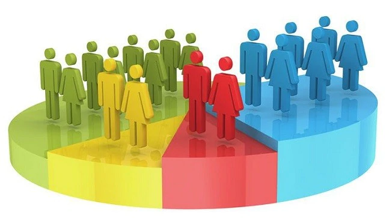

# Census_Income_Prediction-

This is a Classification Problem. 

The census data belongs to the citizens of US and other countries and having some related information.

Here, we have data with 14 features with person details and the income which is >50 0r <=50.

we applied Machine learning algorithms to get maximum accuracy to predict the data.

***The Features like -

Age,

WorkClass,

fnlwgt, 

Education,

EducationNum,

MaritalStatus,

Occupation, 

Relationship,

Race,

Gender,

CapitalGain,

CapitalLoss,

HoursPerWeek,

NativeCountry and

Income

The Output willbe the "Income" and remaining will be the input.

**Links:

[1] Vidya Chockalingam, Sejal Shah and Ronit Shaw: “Income Classification
using Adult Census Data”, https://cseweb.ucsd.edu/classes/wi17/cse258-
a/reports/a120.pdf.

[2] Sisay Menji Bekena:“Using decision tree classifier to predict income
levels”, Munich Personal RePEc Archive 30th July, 2017

[3] Mohammed Topiwalla: “Machine Learning on UCI Adult data Set Using
Various Classifier Algorithms And Scaling Up The Accuracy Using
Extreme Gradient Boosting”, University of SP Jain School of Global
Management.

[4] Alina Lazar: “Income Prediction via Support Vector Machine”, International Conference on Machine Learning and Applications - ICMLA
2004, 16-18 December 2004, Louisville, KY, USA.
[5] S.Deepajothi and Dr. S.Selvarajan: “A Comparative 

